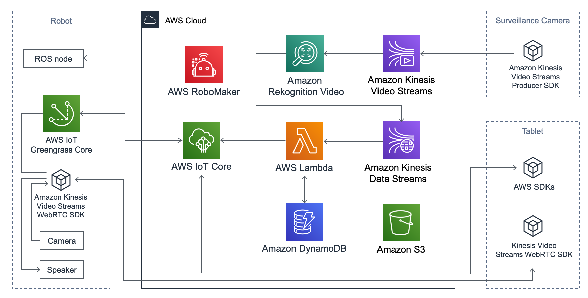

## Autonomous Surveillance Demo

Autonomous Surveillance Demo using AWS RoboMaker, AWS IoT and Amazon Kinesis Video Streams.

## Architecture

## Prerequisite

### Hardware

- Surveillance robot
  - Turtlebot3 burger
  - Raspberry Pi 4 Model B (4GB)
  - microSD card (16GB ~)
  - Raspberry Pi camera
- Surveillance camera
  - An [AWS partner camera device](https://devices.amazonaws.com/) which supports Amazon Kinesis Video Streams (You can also use Raspberry Pi and USB camera instead)
- Remote controlling device
  - A tablet or laptop with a browser which supports WebRTC

## Setup

### Setup AWS

- Follow [the instructions](cloud/README.md)

### Setup robot

- Follow [the instructions](robot/README.md)

### Setup tablet

- Follow [the instructions](tablet/README.md)

## Security

See [CONTRIBUTING](CONTRIBUTING.md#security-issue-notifications) for more information.

## License

This library is licensed under the MIT-0 License. See the LICENSE file.

